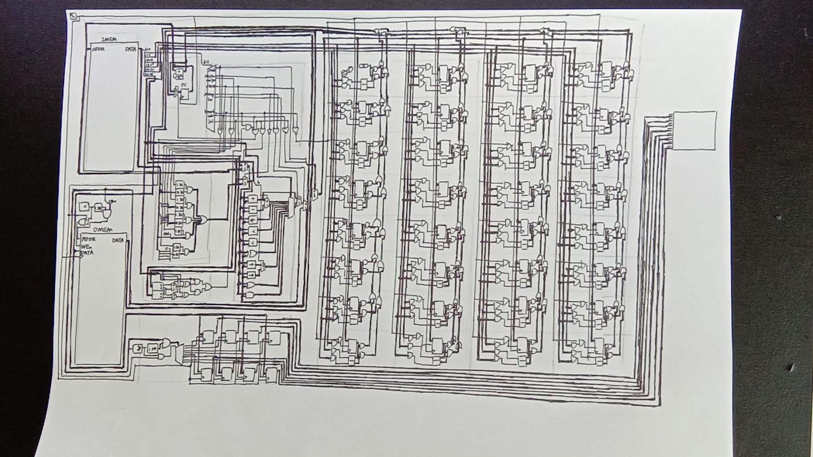

# RISC-V Single Cycle CPU

---

## Notes

- Single page version can achieve ~300 Hz clock rate on a i7-6700K computer.

## Terms and Conditions

The software [Logisim-evoluion](https://github.com/logisim-evolution/logisim-evolution) is released under the terms of the [GNU GENERAL PUBLIC LICENSE (GPL)](https://github.com/logisim-evolution/logisim-evolution/blob/master/LICENSE.md). For your convenience, the jar file is included in this repository in accordance with the redistribution guideline of the GPL-3.0 license agreement.

This project is under MIT License. 
